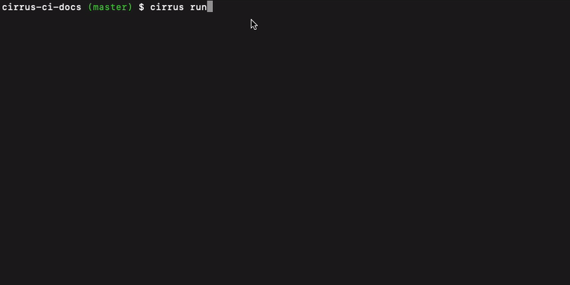

# Echelon - hierarchical logs in terminal on steroids

Cross-platform library to organize logs in a hierarchical structure.

Here is an example how it looks for running Dockerized tasks via [Cirrus CLI](https://github.com/cirruslabs/cirrus-cli):

## Features

* Customizable and works with any VT100 compatible terminal
* Supports simplified output for dump terminals
* Implements incremental drawing algorithm to optimize drawing performance
* Can be used from multiple goroutines
* Pluggable and customizable renderers
* Works on Windows!

## Example

Please check `demo` folder for a simple example or how *echelon* is used in [Cirrus CLI](https://github.com/cirruslabs/cirrus-cli).
